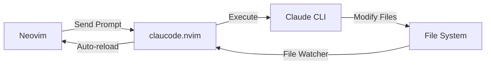

# claucode.nvim

A lightweight Neovim plugin that bridges your editor with [Claude Code CLI](https://github.com/anthropics/claude-code), enabling AI-powered coding assistance without leaving Neovim.

## ✨ Features

- 🔌 **Simple Bridge**: Connects Neovim to Claude Code CLI running in your terminal
- 📁 **Auto-reload**: Automatically detects and reloads files modified by Claude
- 💬 **Quick Commands**: Send prompts and code context directly from Neovim
- 🔍 **Change Review**: Preview Claude's modifications before accepting
- ⌨️  **Smart Keymaps**: Non-conflicting keyboard shortcuts

## 📋 Requirements

- Neovim >= 0.5.0
- [Claude Code CLI](https://github.com/anthropics/claude-code) installed and authenticated

## 📦 Installation

<details>
<summary><b>lazy.nvim</b></summary>

```lua
{
  "your-username/claucode.nvim",
  event = "VeryLazy",
  config = function()
    require("claucode").setup()
  end,
}
```
</details>

<details>
<summary><b>packer.nvim</b></summary>

```lua
use {
  "your-username/claucode.nvim",
  config = function()
    require("claucode").setup()
  end
}
```
</details>

<details>
<summary><b>vim-plug</b></summary>

```vim
Plug 'your-username/claucode.nvim'
```

Add to your `init.lua`:
```lua
require("claucode").setup()
```
</details>

## ⚙️ Configuration

Default configuration:

```lua
require("claucode").setup({
  -- Claude Code CLI command
  command = "claude",
  
  -- Model selection
  model = "claude-3-5-sonnet-20241022",
  
  -- Auto-start file watcher
  auto_start_watcher = true,
  
  -- Keymaps (ai prefix for AI-related actions)
  keymaps = {
    enable = true,
    prefix = "<leader>ai",
  }
  
  -- File watcher settings
  watcher = {
    debounce = 100,
    ignore_patterns = { "%.git/", "node_modules/", "%.swp$" },
  },
})
```

## 🚀 Usage

### Getting Started

1. **Start Claude Code** in your terminal:
   ```bash
   cd your-project
   claude
   ```

2. **Open Neovim** in the same directory

3. **Use commands** to interact with Claude

### Commands

| Command | Description |
|---------|-------------|
| `:Claude <prompt>` | Send a prompt to Claude |
| `:ClaudeReview` | Review pending file changes |
| `:ClaudeStop` | Stop the file watcher |
| `:ClaudeStart` | Start the file watcher |

### Keymaps

Default keymaps use `<leader>ai` prefix (for AI-related actions):

| Keymap | Description | Mode |
|--------|-------------|------|
| `<leader>aic` | Open Claude prompt | Normal/Visual |
| `<leader>air` | Review changes | Normal |
| `<leader>ais` | Stop watcher | Normal |
| `<leader>aiS` | Start watcher | Normal |
| `<leader>aie` | Explain code | Normal/Visual |
| `<leader>aix` | Fix issues | Normal/Visual |
| `<leader>ait` | Generate tests | Normal/Visual |
| `<leader>aif` | Review file | Normal |
| `<leader>aia` | Complete at cursor | Normal |

> **Note**: Using `ai` prefix groups all AI-related actions together and avoids conflicts with common mappings.

## 🔧 How It Works



This plugin acts as a bridge:
1. Send prompts from Neovim to Claude Code CLI
2. Claude processes in the terminal and modifies files
3. File watcher detects changes
4. Modified buffers auto-reload in Neovim

## 🤝 Contributing

Contributions are welcome! Please feel free to submit a Pull Request.

## 📄 License

MIT - see [LICENSE](LICENSE) for details.